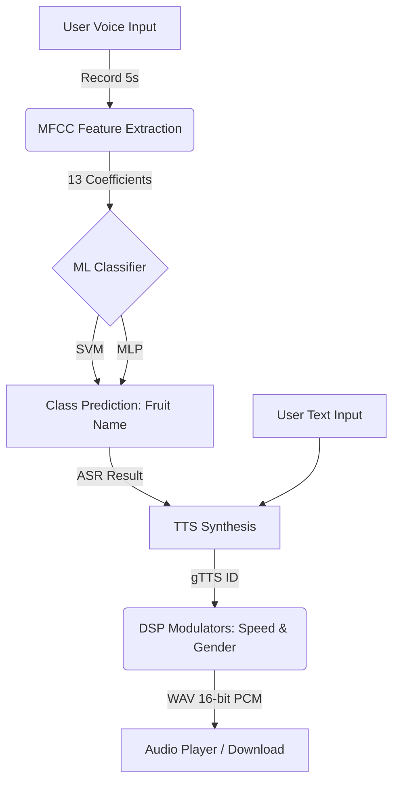

# Slide Presentasi: FruitSpeech ASR & TTS AI Dashboard

Dokumen ini berisi draf slide presentasi yang dapat disalin langsung ke **Microsoft PowerPoint**, **Google Slides**, **Canva**, atau dirender menggunakan format Markdown Slides seperti **Marp**.

---

## Slide 1: Judul Utama & Pengantar
<!-- slide -->
# FruitSpeech AI
### Enterprise ASR & TTS Dashboard for Fruit Commands
*Dibuat untuk memenuhi kriteria Tugas Akhir ASR & TTS Bahasa Indonesia*

**Anggota Kelompok:**
1. [Nama Anggota 1]
2. [Nama Anggota 2]
3. [Nama Anggota 3]
4. [Nama Anggota 4]
5. [Nama Anggota 5]
6. [Nama Anggota 6]

---

## Slide 2: Latar Belakang & Rumusan Masalah
<!-- slide -->
# Latar Belakang & Masalah
* Mengapa interaksi suara dua arah penting untuk aplikasi modern?
* **Tantangan ASR Bahasa Indonesia**: Minimnya dukungan pustaka ASR siap pakai yang ringan untuk perintah suara lokal/terbatas.
* **Tantangan TTS**: Kebutuhan modul Text-to-Speech bahasa Indonesia yang dinamis dengan kontrol parameter vokal (kecepatan & gender).
* **Solusi**: **FruitSpeech** — Dasbor terpadu berbasis web yang menggabungkan pengenal suara berbasis ML mandiri dan pensintesis suara dengan pemrosesan sinyal digital (DSP).

---

## Slide 3: Arsitektur & Teknologi Sistem
<!-- slide -->
# Arsitektur & Teknologi Sistem
Aplikasi dibangun menggunakan ekosistem Python yang tangguh dan visualisasi web modern:
* **Frontend**: Streamlit Web Framework dengan kustomisasi CSS Premium Dark Theme & Glassmorphism.
* **Fitur Audio**: `sounddevice` (perekaman real-time) & `soundfile` (ekspor WAV 16-bit PCM).
* **Ekstraksi Fitur**: `librosa` (Mel-Frequency Cepstral Coefficients - MFCC).
* **Model Klasifikasi (ASR)**: `scikit-learn` (Support Vector Machine & Multi-Layer Perceptron).
* **Sintesis Wicara (TTS)**: `gTTS` (Google Text-to-Speech) + Pemrosesan Sinyal Digital (DSP) menggunakan `librosa.effects`.

---

## Slide 4: Pipeline ASR (Automatic Speech Recognition)
<!-- slide -->
# Pipeline ASR (Pengenalan Suara Mandiri)
ASR dibangun tanpa menggunakan API pihak ketiga untuk menjaga independensi sistem:
1. **Akuisisi Data**: Perekaman suara 5 detik dengan visual feedback waveform di GUI.
2. **Ekstraksi Fitur (MFCC)**: 
   * Sinyal audio diubah menjadi 13 koefisien MFCC untuk menangkap karakteristik spektral unik dari vokal kata.
   * Rata-rata dari koefisien waktu dihitung menjadi *1D Feature Vector* (panjang 13).
3. **Klasifikasi**: Model mencocokkan *vector* fitur suara ke salah satu dari **10 kelas buah** (*apel, jeruk, mangga, pisang, semangka, melon, anggur, pepaya, nanas, stroberi*).

---

## Slide 5: Pipeline TTS (Text-to-Speech)
<!-- slide -->
# Pipeline TTS (Sintesis Wicara + DSP)
Modul TTS tidak hanya menghasilkan suara bahasa Indonesia, melainkan mampu mengkustomisasi suara secara dinamis:
1. **Sintesis Dasar**: Menggunakan `gTTS` untuk mengubah teks input menjadi suara bahasa Indonesia orisinal.
2. **Modulator Kecepatan (Time-Stretching)**:
   * Menggunakan `librosa.effects.time_stretch`.
   * **Lambat**: Kecepatan putar diatur ke `0.75x`.
   * **Cepat**: Kecepatan putar diatur ke `1.30x`.
3. **Modulator Gender (Pitch-Shifting)**:
   * Menggunakan `librosa.effects.pitch_shift` untuk mengubah karakteristik vokal.
   * **Laki-laki**: Pitch digeser turun `-3.5 semitones` (suara berat/ngebass).
   * **Perempuan**: Pitch digeser naik `0.8 semitones` (suara tinggi/nyaring).

---

## Slide 6: Integrasi Sistem (ASR ➡️ TTS)
<!-- slide -->
# Integrasi Sistem ASR ➡️ TTS
Untuk mewujudkan komunikasi dua arah yang interaktif:
* **Integrasi Teks**: Terdapat fitur menyalin teks hasil prediksi ASR langsung ke input editor TTS secara instan.
* **Integrasi Audio**: Tombol *"Bacakan Hasil Prediksi (TTS)"* di halaman ASR memicu sistem untuk langsung menyintesis kalimat konfirmasi suara:
  > *"Suara yang didengar adalah [nama buah]."*
* Hasil konfirmasi tersebut disintesis secara real-time dan langsung diputar ke pengguna melalui antarmuka.

---

## Slide 7: Desain Antarmuka & UX Improvements
<!-- slide -->
# Desain Antarmuka & UX Premium
* **Premium Dark Mode & Glassmorphism**: Tampilan modern dengan background nebula gelap, kartu transparan berefek blur, dan highlight gradien neon buah. Dirancang khusus untuk proyektor (kontras tinggi, mudah dibaca dari 3-5 meter).
* **Manajemen Berkas GUI**: Dilengkapi tombol **Hapus Sampel Terakhir** dan **Kosongkan Semua Sampel** untuk memudahkan manajemen data latih langsung dari web.
* **Deteksi Sinyal & Diagnostik**: Menampilkan peringatan warna merah jika mikrofon merekam keheningan total (amplitudo `0.0`), mempermudah pelacakan isu izin privasi mikrofon di macOS.
* **Visualisasi Grafis Presentasi**: Grafik distribusi jumlah sampel menggunakan *horizontal bar chart* berlabel putih agar audiens tidak perlu memiringkan kepala saat membaca.

---

## Slide 8: Hasil Evaluasi & Pengujian Model
<!-- slide -->
# Hasil Evaluasi & Pengujian Model
* **Model Klasifikasi**: Model **SVM** dan **MLP** dapat dilatih ulang secara instan melalui dasbor.
* **Visualisasi Performa**: Menampilkan Confusion Matrix beresolusi tinggi dan Classification Report (Precision, Recall, F1-Score) untuk mengukur performa prediksi.
* **Generalisasi Dataset**: Disarankan merekam sampel dari berbagai suara teman sekelompok (multi-speaker) agar model mengenali karakteristik fonem kata, bukan karakteristik suara individu (menghindari bias suara).

---

## Slide 9: Kesimpulan
<!-- slide -->
# Kesimpulan
* Aplikasi **FruitSpeech** sukses menggabungkan pipeline ASR mandiri (MFCC + SVM/MLP) dan TTS interaktif dengan kustomisasi DSP (Pitch & Time) di bawah antarmuka web yang mewah.
* Seluruh kriteria tugas wajib (ASR, TTS, ekspor WAV 16-bit PCM, kecepatan putar) dan 4 kriteria tambahan (pilihan gender, confidence score, visualisasi MFCC, integrasi ASR-TTS) telah diimplementasikan **100% dengan sukses**.
* Sistem siap digunakan untuk presentasi dan demo langsung di depan penguji.

---
# Sesi Tanya Jawab (Q&A)
*Terima Kasih atas Perhatian Anda*
